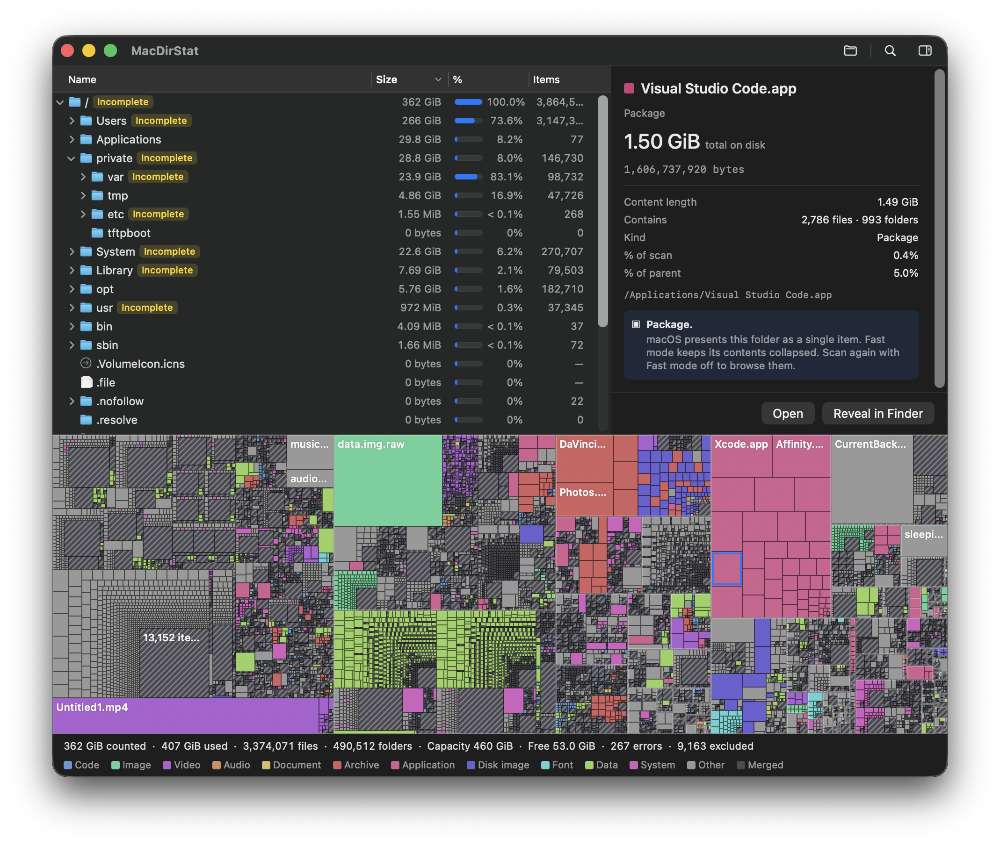

# MacDirStat

**See what’s taking up space on your Mac.**

MacDirStat is a native macOS disk visualizer with a directory tree and a classic
flat treemap. Pick a folder or disk, scan it, and select a rectangle to find the
file behind it. It’s free, open source, and read-only.

[](https://github.com/rengwu/macdirstat/releases/download/v1.0.0/MacDirStat-1.0.0-macos-universal.zip)

macOS 14+ · Apple Silicon & Intel · Prerelease



*A disk scan with Visual Studio Code selected. Rectangle area represents on-disk size.*

[Get started](#get-started) · [Releases](https://github.com/rengwu/macdirstat/releases) · [Report a bug](https://github.com/rengwu/macdirstat/issues) · [MIT license](LICENSE)

## What it does

- **Find large files visually.** The tree and treemap share one selection; the
  detail pane shows the selected item’s size, path, and share of its folder.
- **Scan local folders and disks.** Hidden files are included. Network volumes
  aren’t supported.
- **Keep app bundles compact.** Fast mode measures their contents but shows each
  package as one item. Turn it off before scanning to browse inside packages.
- **Stop a scan and explore what it found.** Cancelled scans retain their partial
  results, with totals marked as lower bounds.
- **Open or reveal a file in Finder.** MacDirStat has no delete, move, or cleanup
  actions.

## Get started

**Requires macOS 14 Sonoma or later. Runs on Apple Silicon and Intel Macs.**

1. Download the [MacDirStat 1.0.0 universal ZIP](https://github.com/rengwu/macdirstat/releases/download/v1.0.0/MacDirStat-1.0.0-macos-universal.zip).
2. Extract it and drag **MacDirStat.app** to **Applications**.
3. Launch MacDirStat and choose a folder or disk to scan.

This is a **prerelease**, ad hoc signed but not yet Developer ID signed or
notarized. macOS may block the first launch; if you trust this download, follow
[Apple’s instructions for opening an app from an unidentified developer](https://support.apple.com/guide/mac-help/mh40616/mac).
You do not need Xcode or an Apple Developer account to run the download.
See the [release notes and checksums](https://github.com/rengwu/macdirstat/releases/tag/v1.0.0)
for verification and known limitations.

### Build from source

Building requires the **full Xcode app**, including its macOS SDK. The standalone
Command Line Tools are not enough to build and test the app. You do not need a
paid Apple Developer account for a local build.

1. Install Xcode and open it once to finish setup. If needed, select it with
   `sudo xcode-select -s /Applications/Xcode.app`.
2. Clone the repository and build:

   ```sh
   git clone https://github.com/rengwu/macdirstat.git
   cd macdirstat
   make release
   ```

3. Open the build folder:

   ```sh
   open .build/xcode/Build/Products/Release
   ```

4. Drag **MacDirStat.app** to **Applications**, then launch it.

To run directly from a development checkout, use `make run`.

## Your first scan

1. Click **Choose…**, or press **⌘O**.
2. Select a disk, or use **Choose Folder…** to add a folder.
3. Choose whether to use **Fast mode**, then click **Search**.
4. Watch the progress card while the scan runs. The tree and treemap appear when
   it finishes; **Cancel** stops early and keeps what was found.
5. Select a file in the tree or treemap to inspect it. Expand folders in the tree
   to browse, or use **Reveal in Finder** to locate the selected item.

| Shortcut | Action |
| --- | --- |
| ⌘O | Choose a folder or disk to scan |
| ⌘R | Reveal the selected item in Finder |
| ⌥⌘C | Copy the selected item’s path |
| ⌘D | Show or hide the detail pane |

### Reading the sizes

**On-disk size** drives rectangle area and the Size column. **Content length**
is the file’s logical length; the detail pane shows it when the displayed figures
differ, such as for sparse files or compressed files. Sizes use binary units
(KiB, MiB, GiB).

A scan with unreadable entries is marked **Incomplete**: its totals are lower
bounds. The result describes the files the scan could measure, rather than a
promise of how much space deleting them would recover. Fast mode retains measured
package totals without keeping their internal file trees.

## Privacy

MacDirStat scans filesystem metadata locally, without reading file contents.
There are no accounts, analytics, or scan uploads. Opening a selected file hands
it to its default application through macOS.

Scan results are held in memory and are not saved between launches. The app saves
window settings, scan preferences, and recent folder paths locally. Clear recent
paths with **File → Open Recent → Clear Menu**.

## Feedback and bugs

[Open an issue](https://github.com/rengwu/macdirstat/issues) with the app version,
your macOS version, whether your Mac uses Apple Silicon or Intel, and the steps
to reproduce the problem. For scan issues, include whether Fast mode was enabled
and whether you scanned a folder, internal disk, or external disk. A small sample
folder that reproduces the issue is especially useful.

Screenshots can include filenames and paths; remove any private details before
sharing them.

## Development

Built with Swift and AppKit. The scan engine and treemap layout are separate
Foundation-only packages with no third-party package dependencies.

See [the development guide](docs/DEVELOPING.md) for build commands, tests, and
repository structure, or [CONTEXT.md](CONTEXT.md) for measurement terminology.
Maintainers can use [the release guide](docs/RELEASING.md) to prepare a GitHub release.

## License

[MIT](LICENSE) — Copyright (c) 2026 John Goh.
